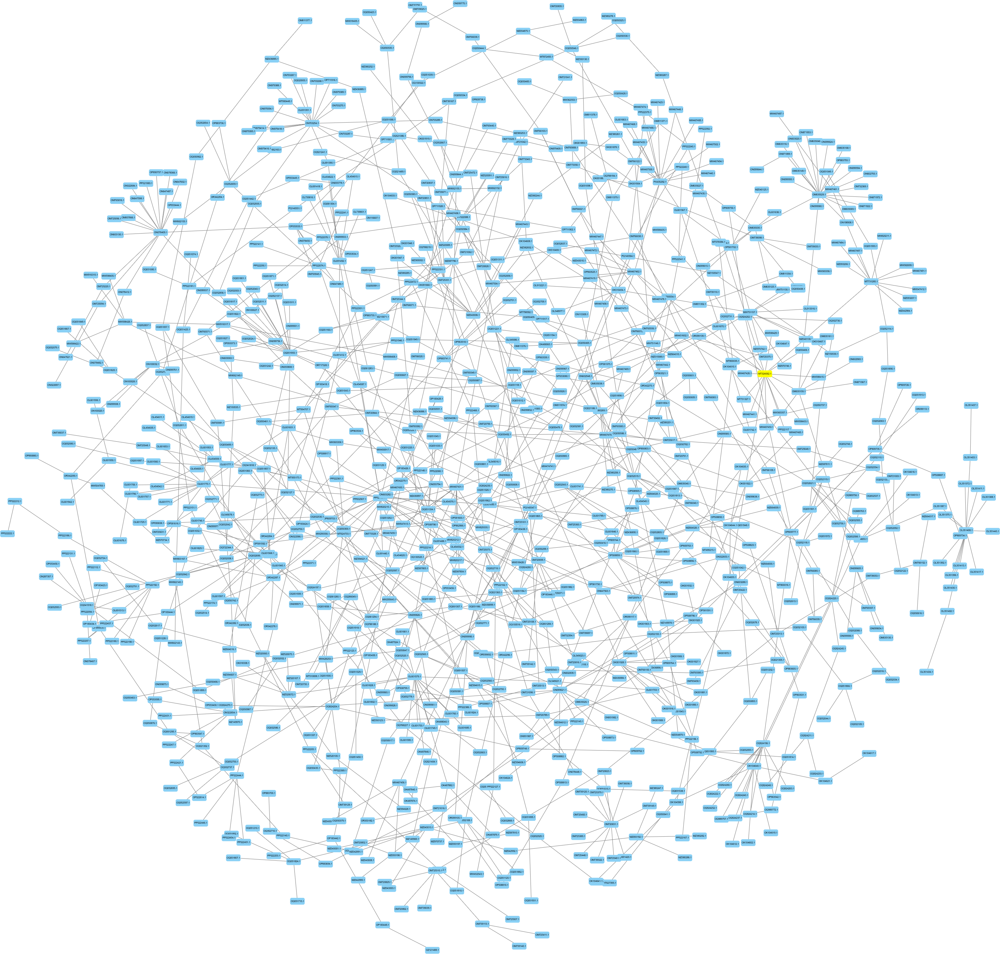
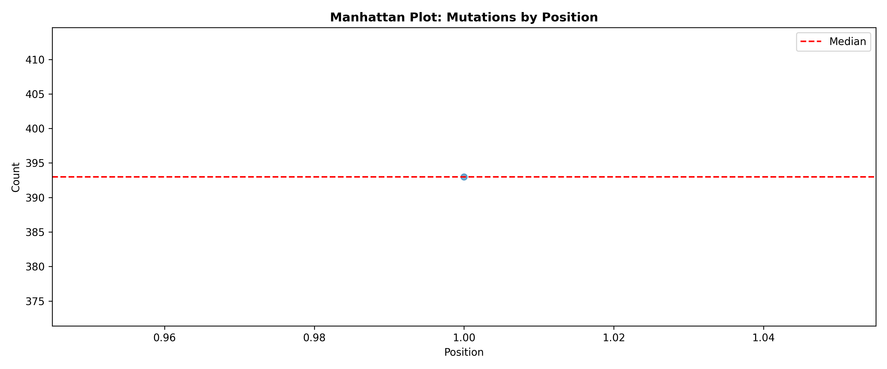

# SARS-CoV-2 Genomic Variation and MST Analysis

This project analyzes SARS-CoV-2 genome sequences using bioinformatics and data science techniques to identify SNPs, indels, mutation frequencies, and genomic relationships through Minimum Spanning Tree (MST) analysis.

## Methods
- Multiple sequence alignment
- SNP and indel detection
- Mutation frequency analysis
- Distance matrix computation
- Minimum Spanning Tree construction
- Statistical analysis
- Network visualization using Cytoscape

## Tools and Libraries
- Python
- pandas
- NumPy
- Biopython
- scikit-learn
- matplotlib
- seaborn
- NetworkX
- Cytoscape

## Project structure
- plots/ contain visualization outputs
- stats/ contain statistical output files
- final_project.ipynb is the complete analysis notebook
- hoq_final_project_report.pdf is the final project report

## Example Outputs

### MST Network

### Manhattan Plot
